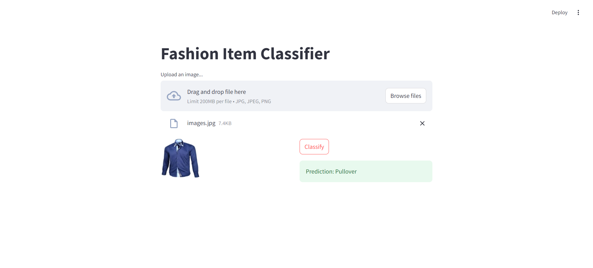

# Fashion-MNIST
Fashion MNIST
Here we are working with Fashion Image Classification (CNN)

This dataset contains different class of images belonging to fashion such as Tshirt, tops, ankleboots etc.

We will try to build a streamlit web app and when we give it an image it should predict weather what that object is.

How to make this work on your workstation/laptop :-
Now here we have 2 folders app and Fashion_Model_Notebook. 

App contains all the files you need for PyCharm. We will work with PyCharm here and Fashion_Model_Notebook is our original notebook. 
Inside app we have our trained_fashion_mnist_model.h5 which is what we wil need. 
Have all these files loaded on Pycharm as is, h5 model should be inside the trained_model folder cause I wrote down the path inside the code. 

After its all done your website must look like this :- 

